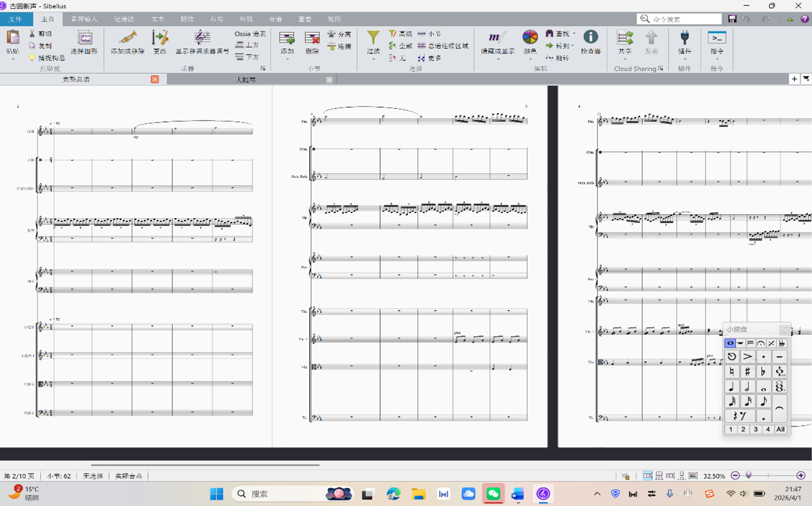
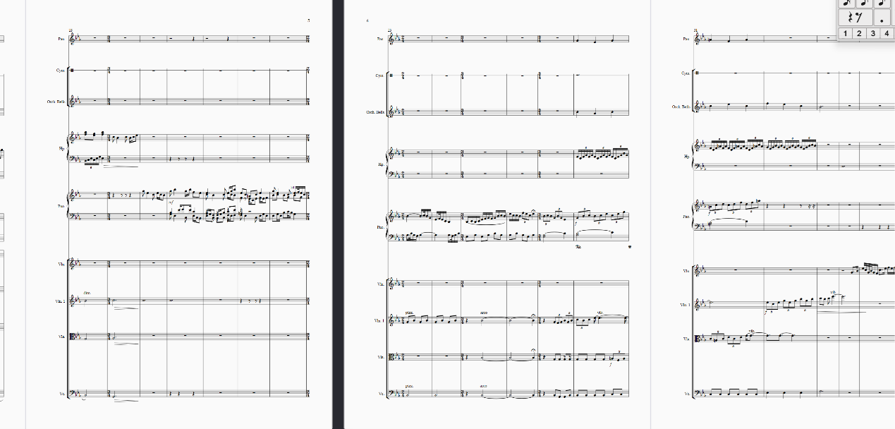
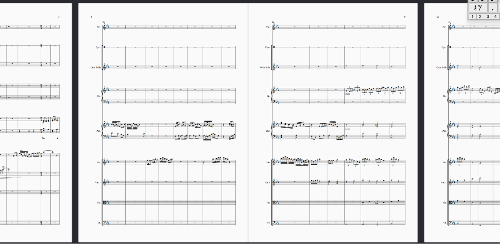
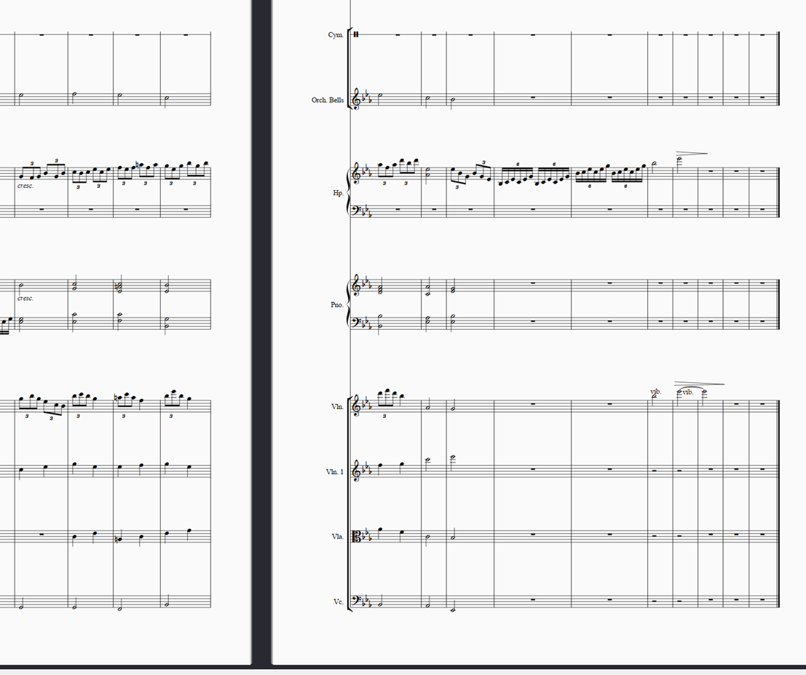

> 本作品也编写了lilypond版本(即本开源项目), 可使用 GNU lilypond 进行编译.

作品细节（从曲式分析角度入手，辅以作曲思路）

整首曲子主要为降E宫调式。第一段的主题非常简单，作为引子的部分，采用蜿蜒式进行，参考了传统江南小调《茉莉花》的旋律部分，用排箫演奏主旋律声部，竖琴演奏密集六连音以模拟园林中烟雨朦胧的场景。从第九小节开始，进入展开部分，排箫的音型也变得密集，并且加入了小提琴与中提琴的拨弦营造步入园林曲折回廊的神秘感。本曲主要采用五声音阶，这与江南音乐的风格相契合，江南音乐多级进与小跳，鲜少可见大跳，这在本曲中也有所体现。

从第十三小节开始，小提琴变化为连弓，弦乐组开始加入，视野变得开阔，弦乐组的演奏遵循呼应原则，为重复关系，相继演奏相同的音型与旋律，将乐曲退向一个小高潮，之后变换拍号（43拍）。

从第十九小节开始，乐曲进入下一个主题，这也是一个相对短小的主题，钢琴部分做了复调化处理，用于表现园子里怪石嶙峋以及拙政园中远香堂、荷风四面亭、见山楼等各抱地势，勾心斗角的场景，体现了建筑物的复杂和精巧。从第25小节开始，转为42拍，做了四小节的一个bridge，主要是为了衔接从园子到屋子内部，随着花窗被打开，乐曲整体走向高潮，用三连音营造婉转但整体逐步向上的趋势，31小节离调到降B宫调式，契合"移步换景、一窗一景"的园林特点。在这里用了vi/v-I做了一个变格半终止，乐曲第一部分告一段落。

从第35小节开始，进入了钢琴与小提琴的阶段，最初写的时候其实是描绘戏台上书生与小姐的对话，类似昆曲的《牡丹亭》，但因为主题写的是建筑，于是，这部分描写的是园子中山水相映，仿佛在对话的场景，亦可以理解为，房梁榫卯结构的交错重叠。

最后就来到了终止式的部分，这是一个非常西洋的终止式，从第51小节开始才正式进入，具体为v7/v-K46-v7-I,做了一个正格完全终止，所以乐曲在第54小节其实就已经终止了，之后的几个小节为扩充终止部分，利用乐曲最开始的音型做一个回应最后结束在主音上，呈现一个收拢性结构。思路上可以理解为，镜头拉了一个全景，呈现一个上帝视角，将整座院子的景色尽收眼底。

